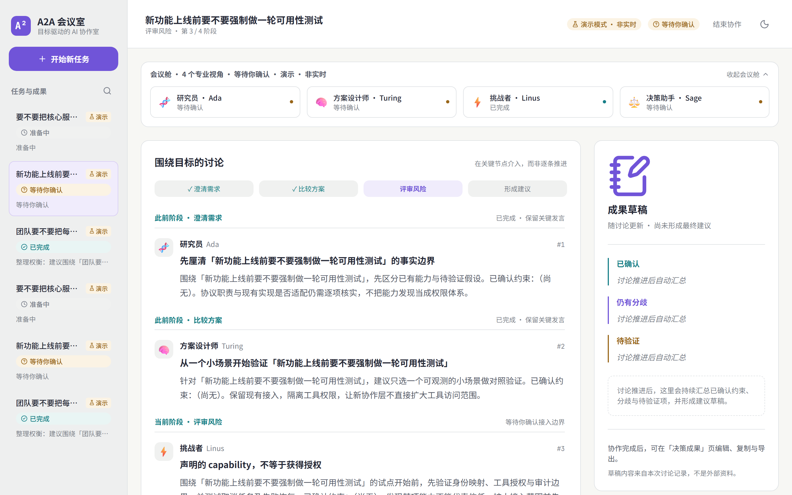
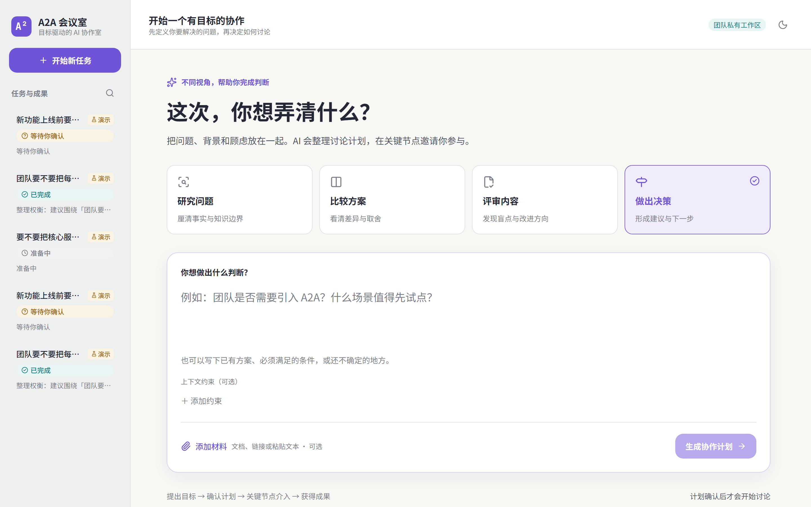
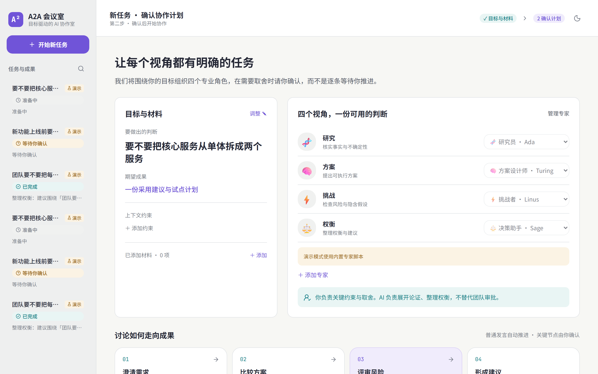
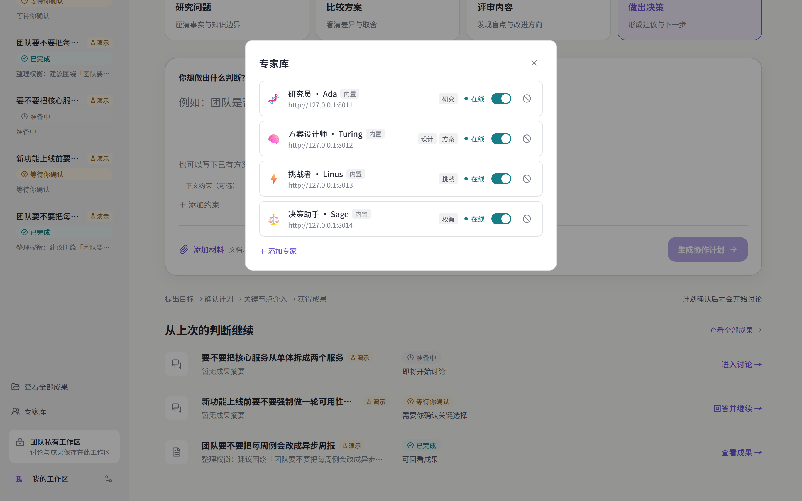
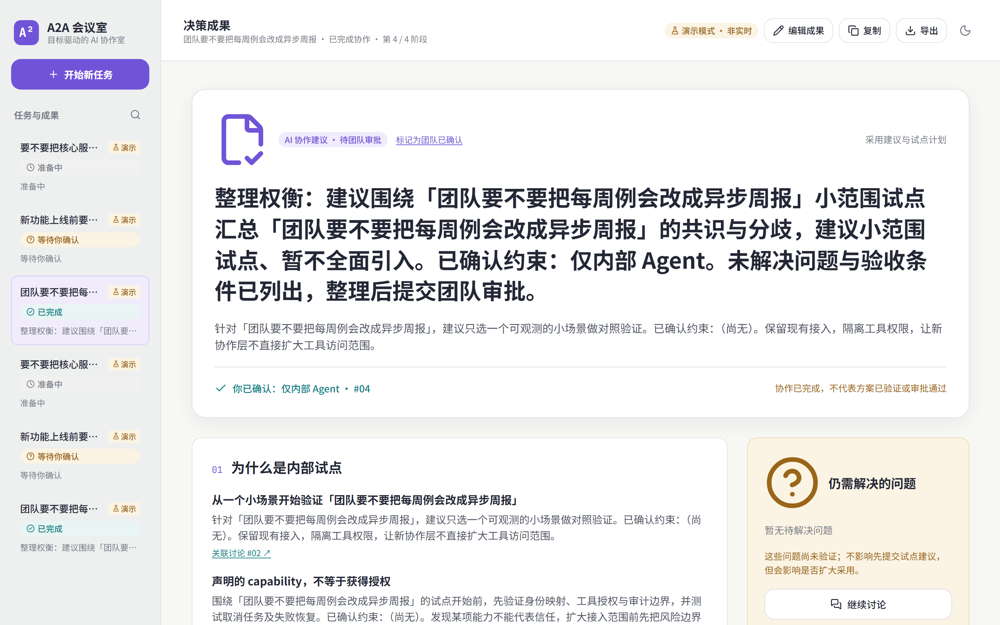

# A2A Agent Swarm Demo

[](https://github.com/wx528/a2a-demo/actions/workflows/ci.yml)
[](https://github.com/wx528/a2a-demo/actions/workflows/llm-smoke.yml)

**English** | [简体中文](README.zh-CN.md)

A minimal runnable **A2A (Agent-to-Agent)** example, including:

- `research-agent`: research agent, takes a topic and returns a summary
- `writing-agent`: writing agent, turns a summary into a Markdown article
- `orchestrator`: orchestrator chaining research → writing with dynamic agent discovery
- `role-agent` (×4 containers): decision role agents — researcher Ada, designer Turing, challenger Linus, synthesizer Sage
- `web`: **decision workspace** (FastAPI + React + SSE) — give it a goal, four experts discuss through defined purposes (research → propose → challenge → synthesize), you step in at key decision gates, and you get a structured outcome

All agents expose the A2A protocol over **JSON-RPC 2.0** (aligned with the [A2A v1.0 specification](https://a2a-protocol.org/latest/specification/)):

- `GET /.well-known/agent-card.json`: Agent Card discovery (legacy path `agent.json` kept as a compat alias)
- `POST /rpc`: JSON-RPC entry point — `SendMessage`, `GetTask`, `CancelTask`, `ListTasks` (legacy names like `tasks/send` kept as aliases)
- `POST /rpc/stream`: SSE streaming entry point — `SendStreamingMessage`, `SubscribeToTask`

## Decision Workspace Preview

| Workspace (dark) | Home (light) |
|---|---|
|  |  |

| Plan — purpose slots | Expert registry | Outcome |
|---|---|---|
|  |  |  |

The web UI is a goal-driven **decision workspace**, not a chat window:

1. **State a goal** (a judgment to make, expected outcome, constraints, materials)
2. **Confirm the plan** — four purpose slots (research / propose / challenge / synthesize) each assigned to an expert; reassign freely from the registry
3. **Watch the discussion** — turns stream token-by-token, organized by stage (clarify → compare → review → recommend), with a live outcome draft on the right
4. **Step in at the decision gate** — when the key trade-off is reached the room pauses for you (adopt / adjust / not sure); your answer steers the revision
5. **Get a structured outcome** — recommendation with confirmed constraints, open questions, and per-turn evidence citations; edit, copy or export as Markdown

**Expert registry**: the four builtin experts are A2A agents (one shared codebase, four containers). Register your **own external A2A agent** (e.g. one with its own memory or toolset) — it gets seated into a purpose slot and receives only the purpose instruction plus discussion context, never a builtin persona.

**Demo mode**: without an `LLM_API_KEY` the workspace runs on deterministic builtin scripts (assignments are pinned to builtin experts), so the full flow is demoable offline.

> V1 meeting room API (`/api/meetings/...`) is still served for compatibility; the UI now focuses on the V2 workspace (`/api/v2/...`).

> Updated 2026-09: data model, method names, enums, error format and timestamp precision are aligned with the current v1.0.0 spec (PascalCase methods, `TASK_STATE_*` / `ROLE_*` enums, `google.rpc.ErrorInfo` errors, millisecond timestamps). Task failures fall through to `TASK_STATE_FAILED`; multi-turn conversations are supported: messages with `taskId` continue an existing task, messages with `contextId` create a new task seeded with the context history. Real token-level streaming and SQLite task persistence are built in.

---

## Project Structure

```
~/a2a/
├── shared/                 # A2A data models + JSON-RPC server/client + LLM client + task store
│   ├── models.py           # A2A v1.0 data models (Pydantic v2, camelCase aliases)
│   ├── a2a_server.py       # Reusable JSON-RPC agent server (tasks, streaming)
│   ├── a2a_client.py       # Minimal A2A JSON-RPC client
│   ├── llm_client.py       # OpenAI-compatible LLM client (blocking + streaming)
│   └── task_store.py       # SQLite task persistence (opt-in via TASK_DB)
├── research_agent/         # Research agent
│   ├── main.py
│   └── Dockerfile
├── writing_agent/          # Writing agent
│   ├── main.py
│   └── Dockerfile
├── debate_agent/           # Persona debate agent
│   ├── main.py
│   └── Dockerfile
├── orchestrator/           # Orchestrator with dynamic agent discovery
│   ├── main.py
│   ├── registry.py         # AgentRegistry: discovery via Agent Card
│   └── Dockerfile
├── debate/                 # Persona debate CLI orchestrator
│   ├── personas.py         # Persona library (socrates / hume / kant / ...)
│   └── run_debate.py       # Multi-round debate + judge verdict
├── role_agent/               # Decision role agent (one codebase, four via ROLE env)
│   ├── main.py               # ROLE=ada|turing|linus|sage picks the persona
│   └── Dockerfile
├── evals/                  # Conformance suite + debate quality evals
│   ├── conformance/        # A2A spec-compliance checks (offline)
│   ├── quality/            # Motion set, metrics, LLM-as-judge, runner
│   └── README.md           # Evaluation guide (two tiers)
├── web/                    # Decision workspace web demo
│   ├── main.py             # FastAPI app (V1 meetings API + V2 workspace API + SPA)
│   ├── v2/                 # V2 core: models / store / orchestrator / agents_client / experts / demo
│   ├── db.py               # SQLite persistence for V1 meetings
│   ├── frontend/           # Vite + React (V2 workspace UI, built to dist/)
│   └── Dockerfile
├── .github/workflows/      # CI + LLM smoke tests
├── docker-compose.yml
├── pyproject.toml          # uv dependency management
├── uv.lock
├── .env.example
├── README.md
├── README.zh-CN.md
└── CHANGELOG.md
```

---

## LLM Configuration (optional but recommended)

Agents call an LLM to generate content. Any **OpenAI-compatible API** works:

- OpenAI
- DeepSeek
- SiliconFlow
- Local Ollama / vLLM

Configure via environment variables:

```bash
export LLM_API_KEY="your-api-key"
export LLM_BASE_URL="https://api.openai.com/v1"
export LLM_MODEL="gpt-4o-mini"
```

**It runs without an LLM too** — agents fall back to local template output.

### Common provider examples

Or copy the example file:

```bash
cp .env.example .env
# Edit .env with your API key and model config
vim .env
```

**DeepSeek:**
```bash
export LLM_API_KEY="sk-..."
export LLM_BASE_URL="https://api.deepseek.com"
export LLM_MODEL="deepseek-flash"
```

**SiliconFlow:**
```bash
export LLM_API_KEY="sk-..."
export LLM_BASE_URL="https://api.siliconflow.cn/v1"
export LLM_MODEL="Qwen/Qwen2.5-7B-Instruct"
```

**Local Ollama:**
```bash
export LLM_BASE_URL="http://host.docker.internal:11434/v1"
export LLM_MODEL="llama3.1"
# Ollama usually needs no API key
```

---

## Quick Start

### 1. Docker Compose (recommended)

```bash
cd ~/a2a
docker compose up --build
```

Once running:
- Web decision workspace: http://localhost:8080
- Orchestrator: http://localhost:8000
- Research Agent: http://localhost:8001
- Writing Agent: http://localhost:8002
- Role agents (ada / turing / linus / sage): http://localhost:8011 - 8014

### 2. Test the Agent Card

```bash
curl http://localhost:8001/.well-known/agent-card.json
curl http://localhost:8002/.well-known/agent-card.json
```

### 3. Test the full workflow

```bash
curl -X POST http://localhost:8000/create-article \
  -H "Content-Type: application/json" \
  -d '{"topic": "kubernetes"}'
```

### 4. Call a single agent directly (via the orchestrator)

```bash
# Call the research agent (short name, card name, or skill id all work)
curl -X POST http://localhost:8000/direct/research \
  -H "Content-Type: application/json" \
  -d '{"topic": "a2a"}'

# Call the writing agent
curl -X POST http://localhost:8000/direct/writing \
  -H "Content-Type: application/json" \
  -d '{"topic": "Core concepts of the A2A protocol"}'
```

### 5. Talk A2A JSON-RPC directly

```bash
# research-agent: send a task (blocking)
curl -X POST http://localhost:8001/rpc \
  -H "Content-Type: application/json" \
  -d '{
    "jsonrpc": "2.0",
    "id": 1,
    "method": "SendMessage",
    "params": {
      "message": {
        "messageId": "msg-001",
        "role": "ROLE_USER",
        "parts": [{"text": "kubernetes"}]
      }
    }
  }'

# Query task status
curl -X POST http://localhost:8001/rpc \
  -H "Content-Type: application/json" \
  -d '{
    "jsonrpc": "2.0",
    "id": 2,
    "method": "GetTask",
    "params": {"id": "TASK_ID_HERE"}
  }'

# Stream a task (SSE, token-level chunks)
curl -N -X POST http://localhost:8001/rpc/stream \
  -H "Content-Type: application/json" \
  -d '{
    "jsonrpc": "2.0",
    "id": 3,
    "method": "SendStreamingMessage",
    "params": {
      "message": {
        "messageId": "msg-002",
        "role": "ROLE_USER",
        "parts": [{"text": "a2a"}]
      }
    }
  }'
```

---

## Local Development (without Docker)

Dependencies are managed with [uv](https://docs.astral.sh/uv/):

```bash
cd ~/a2a

# Install dependencies (per uv.lock)
uv sync

# Start the research agent
uv run python research_agent/main.py &

# Start the writing agent
uv run python writing_agent/main.py &

# Start the orchestrator
uv run python orchestrator/main.py &
```

Set these environment variables when running locally:

```bash
export RESEARCH_AGENT_URL=http://localhost:8001
export WRITING_AGENT_URL=http://localhost:8002

# Optional: LLM
export LLM_API_KEY="your-api-key"
export LLM_BASE_URL="https://api.openai.com/v1"
export LLM_MODEL="gpt-4o-mini"
```

Or simply put your keys in a root `.env` (`cp .env.example .env`) — services
auto-load it on local runs; explicitly exported variables take precedence.

---

## Testing & CI

| Layer | File | Notes |
|-------|------|-------|
| Unit | `test_a2a.py` / `test_registry.py` / `test_task_store.py` | Protocol behavior, registry, persistence — no services needed |
| End-to-end | `test_e2e.py` | Real processes, agent + orchestrator workflow |
| Workspace (V2) | `test_v2_*.py` / `test_experts_*.py` / `test_role_agent.py` / `test_think_filter.py` | Orchestrator state machine, decision gate, expert registry, demo scripts, role agent |
| Web integration (V1) | `test_web.py` / `test_web_turns.py` / `test_web_scheduler.py` | Meeting room SSE full chain |
| LLM smoke | `test_llm_smoke.py` | Real LLM (DeepSeek by default); auto-skips without a key |

CI (GitHub Actions):
- **CI** (every push/PR): ruff + all offline tests, no LLM cost
- **LLM Smoke** (push to main / manual): verifies non-fallback output and real streaming with a live key; requires the `LLM_API_KEY` secret (DeepSeek), overridable via Variables `LLM_BASE_URL`/`LLM_MODEL` (defaults: `https://api.deepseek.com` / `deepseek-flash`)

---

## Decision Workspace Demo (Web)

### Start

The web service is part of docker compose:

```bash
cd ~/a2a
docker compose up -d
```

### Open

Visit: http://localhost:8080

### Flow

1. Pick a goal card (research / compare / review / **decide**) and describe the judgment to make, plus expected outcome, constraints and materials
2. Confirm the plan: four purpose slots — research, propose, challenge, synthesize — each seated with an expert; open **专家库 (Expert Registry)** to enable/disable experts or register your own A2A agent, and reassign any slot
3. Start the collaboration: turns stream live, grouped by stage (clarify → compare → review → recommend); the meeting pod shows each expert's state (thinking / speaking / waiting)
4. At the **decision gate** the room pauses for you: adopt, adjust, or mark key uncertainty — the discussion continues from your answer
5. When done, the **outcome page** renders the recommendation: confirmed constraints, divergences, items to verify, evidence links back to the exact turns; edit / copy / export as Markdown

### Expert Registry (guest experts)

- Four builtin experts (Ada / Turing / Linus / Sage) are A2A agents — one shared codebase, four containers on ports 8011-8014
- Register an **external A2A agent** by URL (a reachability probe runs on save); tag it with what it is good at and it will be suggested for matching purpose slots
- Guest experts receive only the purpose instruction + goal/constraints + recent discussion — **no builtin persona is injected**, so their own memory/style remains intact
- Assignments are frozen into the task when the discussion starts (snapshot semantics); registry changes never retroactively alter running or finished tasks
- Deleting builtin experts is not allowed (disable instead); demo tasks always use builtin scripts

### Implementation

- **Backend**: FastAPI + SSE; in-process orchestrator (`web/v2/orchestrator.py`) drives the auto-advancing loop, decision gates, interventions and retries; six task states (`preparing / running / waiting_confirmation / paused / completed / failed`) with crash-safe resume
- **Agent calls**: every turn is an A2A JSON-RPC streaming call (`SendStreamingMessage`) to the seated expert's agent; a stateful think-filter hides reasoning tokens but keeps `# UNVERIFIED` self-doubt markers
- **Frontend**: Vite + React + Tailwind, hash-based mini router (`#/`, `#/plan`, `#/task/:id`, `#/task/:id/outcome`), light/dark themes, Noto Sans SC + JetBrains Mono
- **Persistence**: SQLite (`V2_DB`, default `data/v2_tasks.db`)

### Workspace env vars

```bash
V2_DEMO=1                    # force demo mode (auto-on when no LLM_API_KEY)
V2_DB=data/v2_tasks.db       # task persistence path
ROLE_AGENT_URLS="ada=http://127.0.0.1:8011,turing=http://127.0.0.1:8012,linus=http://127.0.0.1:8013,sage=http://127.0.0.1:8014"
V2_DEMO_TURN_DELAY=0.6       # demo pacing, seconds per turn
```

### Frontend (web/frontend)

```bash
# Dev mode (start the backend first: uv run python web/main.py)
cd web/frontend
npm install
npm run dev        # http://localhost:5173, /api is proxied to :8080

# Production build
npm run build      # outputs web/frontend/dist, served automatically by FastAPI
```

The Docker image builds the frontend automatically — no manual step required.

---

## Persona Debate Demo

A fact-grounded debate between personas (philosophers and modern archetypes).
Each turn: the `debate-agent` retrieves web sources, then argues with inline
citations; missing evidence is declared, never fabricated.

```bash
# start the debate agent (or docker compose up)
uv run python debate_agent/main.py &

uv run python debate/run_debate.py "Will AI replace most jobs?" \
    --pro socrates --con hume --rounds 2
```

Personalities: `socrates`, `hume`, `kant`, `nietzsche`,
`skeptic_engineer`, `vc`. Search works out of the box via DuckDuckGo;
set `SEARCH_PROVIDER=tavily` + `SEARCH_API_KEY` for higher quality.

Sample transcript (abridged):

```markdown
## Turn 1 · 苏格拉底（PRO）

我们要先问：所谓"取代"，究竟指任务被自动化，还是指人的价值被消除？
历史数据显示，ATM 普及后美国银行柜员岗位不降反升 [来源1](https://www.aei.org/...)。
但请注意：这是相关性陈述，因果仍是推演……

## Judge Verdict · 裁判

正方最强论据来自就业结构数据 [来源1](https://www.aei.org/...)，
反方对"任务替代 ≠ 岗位替代"的区分未被任何来源直接支撑，属于未查证推演……
```

---

## Evaluation

Two tiers — see [evals/README.md](evals/README.md):

- **Conformance suite** (offline, free): 11 deterministic A2A spec-compliance
  checks against any live agent; runs in CI on every push
- **Debate quality evals** (LLM-as-judge, manual dispatch): citation coverage,
  link liveness, claim support, persona adherence and trap-motion honesty
  across a 15-motion set, with JSON + Markdown reports

---

## Extending

1. **Plug in a real LLM**: set `LLM_API_KEY` and friends
2. **Add an agent**: copy an existing agent, tweak `process_task`, add its URL to `AGENT_URLS` (or call `POST /agents/refresh` at runtime)
3. **Auth & security**: declare securitySchemes in the Agent Card, validate `A2A-Version`, push notifications
4. **Cooperative cancellation**: CancelTask marks the task CANCELED, but a running worker (blocking or streaming) keeps processing to completion and burns LLM tokens until then — late writes are discarded by the terminal-state guard
5. **Task pagination**: switch `ListTasks` to cursor-based paging (`nextPageToken`)
6. **Retries**: add retry/timeout control in the orchestrator
7. **Kubernetes**: turn each service into a Deployment + Service

---

## References

- [A2A Protocol Specification](https://a2a-protocol.org/latest/specification/)
- [A2A Protocol on GitHub](https://github.com/a2aproject/A2A)
